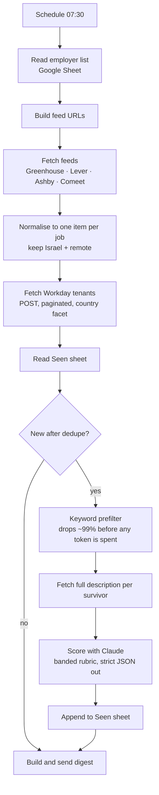

# ats-job-scanner

A daily job scanner that reads employer applicant-tracking systems directly instead of
scraping job boards, scores every new posting against one candidate profile with an LLM,
and emails a short digest each morning.

It runs on n8n Cloud, costs a few cents a day, and has been running unattended since
September 2026. I built it because the job boards aggregating Israeli tech roles are
slow, noisy and incomplete, while almost every employer already publishes a clean,
public, unauthenticated JSON feed that nobody reads.

The part of this repo most likely to be useful to someone else is
**[docs/ats-feeds.md](docs/ats-feeds.md)**: working notes on the five ATS APIs, including
the two that are genuinely awkward to work with.

## What it does

Every morning at 07:30 it pulls the open roles from ~215 employers, keeps the ones in
Israel or genuinely remote, screens them on title, sends the survivors to Claude with a
scoring rubric, logs every decision to a Google Sheet so nothing is scored twice, and
sends one email.



Measured on a normal morning: **10,478 live postings** across the tracked boards,
**1,502 of them in Israel**, about **2,200** reaching the scanner as in-scope after the
location filter, and **6 to 17** surviving the keyword prefilter to be scored. The
prefilter is doing the heavy lifting: scoring everything with an LLM would cost roughly
two hundred times more and return the same answer.

## Design decisions worth explaining

**Read the ATS, not the job board.** Aggregators lag, drop postings, and add roles that
no longer exist. `boards-api.greenhouse.io` is the employer's own database, updated the
moment a recruiter hits publish. The tradeoff is that you maintain a list of employers
and the shape of five different APIs, which is what this repo is.

**Filter before you spend tokens.** A cheap regex pass runs before the model does. The
interesting failure here was the first version, which let `student`, `junior` and
`graduate` override the engineering-role block, so "Graduate Backend Software Engineer"
reached the model every day and was correctly rejected every day, at full cost. The
opposite bug was worse and quieter: a blanket `security` block was silently discarding
"Sales Development Representative, Security" at cyber companies, which is exactly the
kind of role the whole system exists to find. Both are fixed; both are in the test suite.

**Band the roles, then cap the band.** An unweighted "how good a fit is this" prompt
quietly rewards prestige, because a well-known company lifts every posting. The rubric
instead sorts role types into bands and caps the maximum a band can reach, so a famous
logo cannot drag a role into the top tier. It also instructs the model to read the
day-to-day responsibilities rather than the title, since job titles are marketing.
See [scoring_prompt.example.md](scoring_prompt.example.md).

**One idempotent log.** Every scored posting, including rejections and the reason, is
appended to a "Seen" sheet keyed by a composite `ats:slug:id`. That sheet is the dedupe
mechanism, the audit trail and the only state the system has. Re-running the workflow is
therefore safe.

## Engineering notes

Four things cost real time and are not documented anywhere obvious.

Requesting full job descriptions for every posting up front exhausted the n8n Cloud
memory limit and crashed the instance. The fix is a two-stage fetch: list endpoints for
everything, detail endpoint only for the postings that survive the prefilter.

n8n splits a JSON array response into one item per element, and a Code node running in
"all items" mode cannot see `pairedItem`, so it loses track of which employer a job came
from. A tiny run-per-item node that stamps the source onto each item first solves it.

Comeet rotates its public board tokens. A feed that worked yesterday returns HTTP 400
today, which looks like a dead company but is not. The audit script distinguishes the
three failure modes that matter: empty board, rotated token, dead slug.

An n8n Code node is killed at 60 seconds. Anything that fans out over hundreds of URLs
has to be batched through a loop node or split across several nodes.

## Repo layout

| Path | What it is |
|---|---|
| `src/build_workflow.py` | Generates the workflow. Holds every Code node's JavaScript. Source of truth for structure. |
| `src/fetch_workday.js` | The Workday node, kept separate because it is long. |
| `src/test_harness.js` | Runs every Code node against fixtures outside n8n. `node src/test_harness.js`. |
| `src/make_export.example.py` | Fills your own sheet id and credential ids into the generated workflow. |
| `workflow/job-scanner.workflow.json` | Importable n8n workflow, no secrets. |
| `scoring_prompt.example.md` | The scoring rubric, with the personal sections left as TODO. |
| `docs/ats-feeds.md` | Notes on all five ATS APIs. |
| `docs/israeli-tech-ats-directory.tsv` | Which ATS ~110 Israeli tech employers actually use. |
| `docs/sample-digest.html` | What the morning email looks like, rendered from test fixtures. |

## Running it yourself

```bash
git clone https://github.com/<you>/ats-job-scanner && cd ats-job-scanner
node src/test_harness.js          # should print ALL CODE NODES PASS
cp scoring_prompt.example.md scoring_prompt.md   # then fill in the TODO sections
python3 src/build_workflow.py     # regenerates workflow/job-scanner.workflow.json
python3 src/make_export.example.py  # after pasting your own ids into it
```

Import the resulting `workflow/job-scanner.local.json` into n8n, attach Google Sheets,
Gmail and Anthropic credentials, and create a sheet with two tabs: `Companies`
(`company, ats, slug, type, active, il_jobs_on_scan_day, notes`) and `Seen`
(`job_id, first_seen, company, title, location, url, source, posted_at, score, tier,
role_family, seniority_read, why_fit, gap, angle, disqualifier, status`).

The location filters are hardcoded for Israel and would need rewriting for anywhere else.

## Honest limitations

The employer list is hand-maintained. There is no discovery step, so the scanner only
finds roles at companies someone thought to add.

Coverage stops where the public feeds stop. Employers on Workday are supported, but those
on SuccessFactors, Taleo, Jobvite or a bespoke careers site are not, and that excludes
some large names.

Three Workday tenants answer the API but do not expose a location facet the discovery
code can find, so they are not usable yet.

Workday list responses carry no job description, only title and location, so the
prefilter judges those postings on the title alone.

And the honest one: a clean pipeline does not create opportunities. Six days of running
surfaced three roles worth applying to the same day. That is a fair reading of the market
for junior go-to-market roles in Tel Aviv, not a bug, and no amount of engineering
changes it.

## License

MIT. The ATS notes and the employer directory are the parts worth taking.
