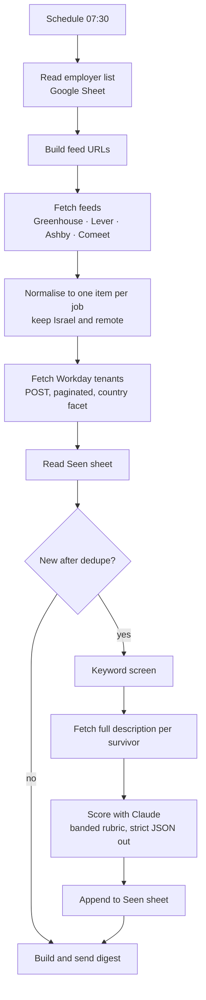

# ats-job-scanner

Reads employer applicant tracking systems directly and emails one scored digest every morning.

The job boards that aggregate Israeli tech roles are slow, incomplete, and full of postings that no longer exist. Rather than argue with the boards I went to the source. Almost every employer already publishes a clean, public, unauthenticated JSON feed to render its own careers page. Almost nobody reads them.

215 employers. Five ATS platforms. One email at 07:30.

The part most likely to be useful to someone else is [docs/ats-feeds.md](docs/ats-feeds.md), working notes on all five APIs including the two awkward ones.

## What it does



Measured on 14 September 2026. An audit of every board counted 10,478 open roles, 1,502 of them in Israel. A normal morning puts between 1,600 and 2,200 Israel or remote postings in scope. Six to seventeen survive the keyword screen and get scored.

That screen is the whole economics. Scoring everything with a model would cost over two hundred times more and return the same answer.

## Why it is built this way

**Read the ATS, not the job board.** `boards-api.greenhouse.io` is the employer's own database. It updates the moment a recruiter hits publish. The cost is that you maintain a list of employers and the shape of five different APIs. That is what this repo is.

**Filter before you spend tokens.** A regex pass runs before the model does. Roughly 99 percent of in-scope postings never reach it.

**Band the roles, then cap the band.** An unweighted "how good a fit is this" prompt rewards prestige. A known logo lifts every posting it touches. So the rubric sorts role types into bands and caps what each band can reach. A famous name cannot drag a role into the top tier. It also instructs the model to read the responsibilities rather than the title, because titles are marketing. See [scoring_prompt.example.md](scoring_prompt.example.md).

**One log, and make it idempotent.** Every scored posting goes to a Seen sheet keyed on `ats:slug:id`, rejections included, with the reason. That sheet is the dedupe, the audit trail, and the only state the system has. Re-running the workflow is safe.

## What I got wrong

Two screening bugs, in opposite directions. Both are now in the test suite.

The first version let `student`, `junior` and `graduate` override the engineering block. "Graduate Backend Software Engineer" reached the model every morning and was correctly rejected every morning, at full cost. Expensive, but visible.

The second was worse because it was silent. A blanket block on the word `security` was discarding "Sales Development Representative, Security" at cyber companies. That is exactly the role this system exists to find. It ran that way for days and nothing in the output showed it.

Four more things cost real time and are written up in [docs/ats-feeds.md](docs/ats-feeds.md). Fetching every job description up front exhausted the n8n memory limit and crashed the instance. n8n splits a JSON array into one item per element, and a Code node in all-items mode cannot read `pairedItem`, so it loses track of which employer a job came from. Comeet rotates its board tokens, so a feed that worked yesterday returns HTTP 400 today and looks like a dead company. An n8n Code node is killed at 60 seconds.

Claude wrote most of the code. I designed the pipeline, decided what to filter and how to score, and did the debugging above.

## Repo layout

| Path | What it is |
|---|---|
| `src/build_workflow.py` | Generates the workflow. Holds every Code node's JavaScript. Source of truth for structure. |
| `src/fetch_workday.js` | The Workday node, kept separate because it is long. |
| `src/test_harness.js` | Runs every Code node against fixtures, outside n8n. |
| `src/make_export.example.py` | Fills your own sheet id and credential ids into the generated workflow. |
| `workflow/job-scanner.workflow.json` | Importable n8n workflow. No secrets in it. |
| `scoring_prompt.example.md` | The scoring rubric, personal sections left as TODO. |
| `docs/ats-feeds.md` | Notes on all five ATS APIs. |
| `docs/israeli-tech-ats-directory.tsv` | Which ATS 118 Israeli tech employers actually use. |
| `docs/sample-digest.html` | What the morning email looks like, rendered from fixtures. |

## Running it

```bash
git clone https://github.com/RoyManor1/ats-job-scanner && cd ats-job-scanner
node src/test_harness.js                          # prints ALL CODE NODES PASS
cp scoring_prompt.example.md scoring_prompt.md    # then fill in the TODO sections
python3 src/build_workflow.py                     # regenerates the workflow JSON
python3 src/make_export.example.py                # after pasting your own ids into it
```

Import the resulting `workflow/job-scanner.local.json` into n8n. Attach Google Sheets, Gmail and Anthropic credentials.

Then create a sheet with two tabs. `Companies` takes `company, ats, slug, type, active, il_jobs_on_scan_day, notes`. `Seen` takes `job_id, first_seen, company, title, location, url, source, posted_at, score, tier, role_family, seniority_read, why_fit, gap, angle, disqualifier, status`.

The location filters are hardcoded for Israel and would need rewriting for anywhere else.

## What it does not do

The employer list is maintained by hand. There is no discovery step, so the scanner only finds roles at companies someone thought to add.

Coverage stops where the public feeds stop. Workday is supported. SuccessFactors, Taleo, Jobvite and bespoke careers sites are not. That excludes some large employers.

Three Workday tenants answer the API but expose no location facet the discovery code can find, so they are not wired up.

Workday list responses carry no job description, only a title and a location, so the screen judges those postings on the title alone.

And the one that matters most. A clean pipeline does not create opportunities. Six days of running surfaced three roles worth applying to the same day. That is a fair reading of the market for junior go-to-market roles in Tel Aviv, not a bug, and no amount of engineering changes it.

## License

MIT. The ATS notes and the employer directory are the parts worth taking.
